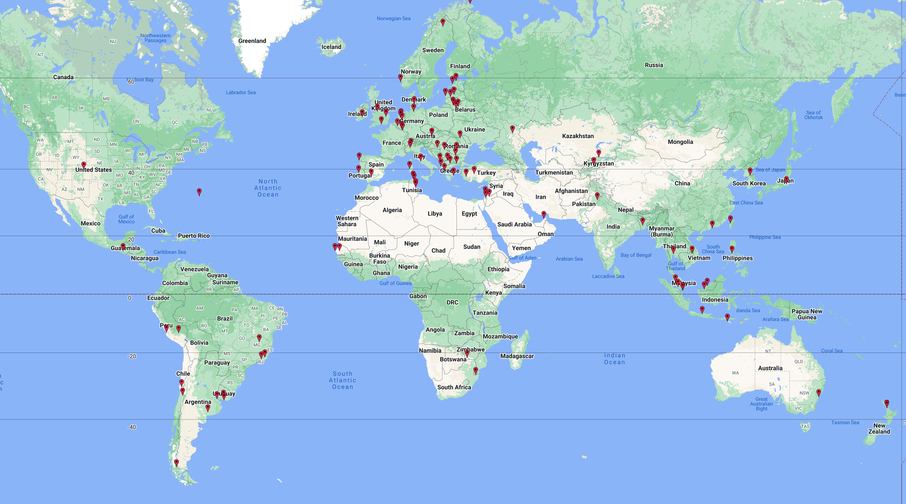

A tool to record all locations 'visited' in Geoguessr Battle Royale games. This program uses a Firefox Web Extension to log information about each 'visited' location and sends the information to a MongoDB Atlas Database instance in AWS. The rust script is used to pull information from the MongoDB Atlas instance and format it into a .csv (Comma Separated Value) file that is able to be fed into mapping tools. 

A screenshot of the first 100 or so locations:
